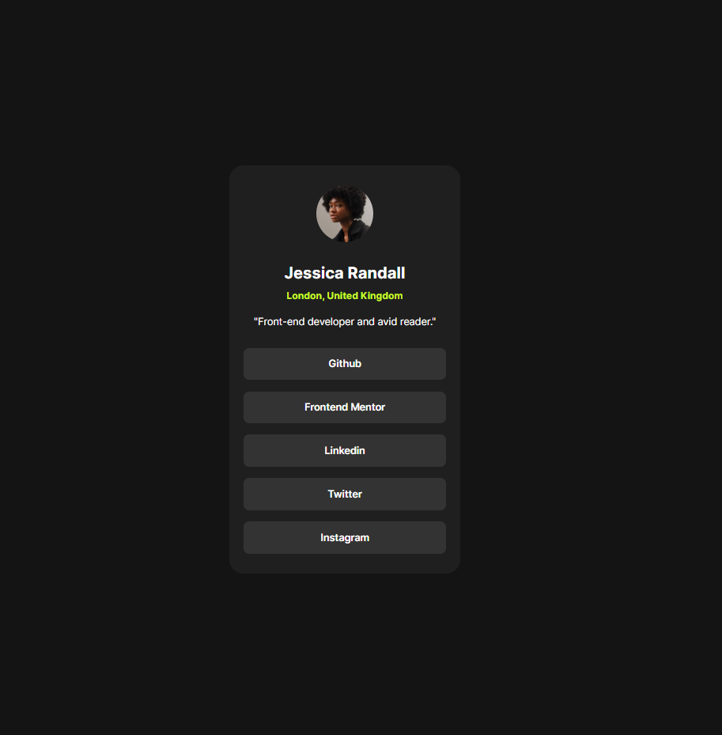

# Frontend Mentor - Social links profile solution

This is a solution to the [Social links profile challenge on Frontend Mentor](https://www.frontendmentor.io/challenges/social-links-profile-UG32l9m6dQ).

## Overview

### The challenge

Users should be able to:

- See hover for all interactive elements on the page

### Screenshot

### Links

- Live Site URL: [AAA social links profile](https://fem-sociallinksprofile.vercel.app/)

## My process

### Built with

- Semantic HTML5 markup
- CSS custom properties
- Flexbox
- Mobile-first workflow
- SASS for styles

## Author

- Website - [Ata Abatay](https://www.ataabatay.com)
